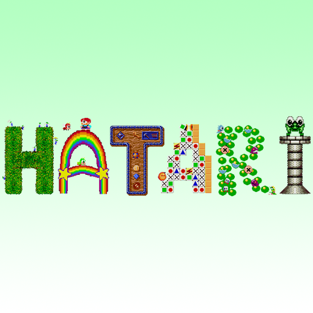

# Atari - ST/STE/TT/Falcon (Hatari)

### Description

Hatari is an Atari ST/STE/TT/Falcon emulator.

Hatari tries to emulate the hardware as close as possible for greater compatibility. Because of this, it may be slower than less accurate emulators.

### License

GPLv2

### Icon

### Fanart

Help make me fanart!

### Screenshots

Help make me screenshots!
